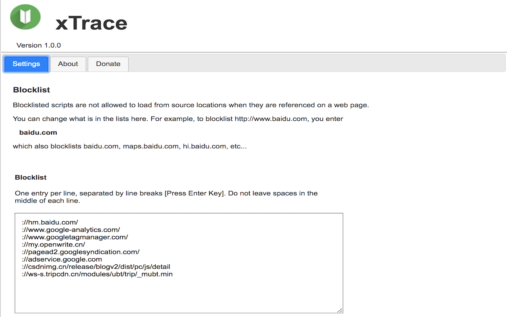
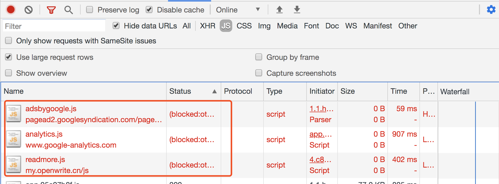
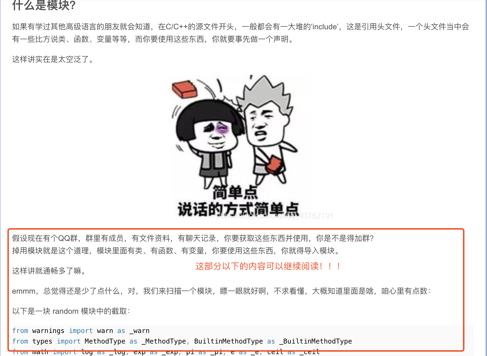

# xTrace

xTrace是一款Chrome扩展插件，用于屏蔽某些追踪用户行为的脚本，以及支持用户自定义屏蔽影响我们流畅阅读博文的前端脚本。

#### 如何安装
**方式一：在线安装**
用户可以通过Chrome Web Store进行在线安装，这里是[直达链接]()
> 使用在线安装可以自动获得本插件(`xTrace`)功能更新

**方式二：离线安装**
1. 下载[源代码](https://github.com/StevenX911/xTrace)到用户本地电脑
2. 打开Chrome，进入扩展程序管理界面，开启`开发者模式`
3. 点击`加载已解压的扩展程序`，选择源代码中的`src`目录并加载
4. 安装成功
> 离线安装无法自动获得功能更新，需要重新下载源代码并加载

#### 使用方法

使用鼠标`左击`扩展程序图标，在弹出的页面中点击`Options`进入配置页面，用户可以在这个页面进行更多自定义的脚本拦截配置，

`xTrace`内置了如下拦截规则：

```
://hm.baidu.com/
://www.google-analytics.com/
://www.googletagmanager.com/
://my.openwrite.cn/
://pagead2.googlesyndication.com/
://adservice.google.com
://csdnimg.cn/release/blogv2/dist/pc/js/detail
```

拦截效果：


#### 拦截示例

打开如下链接：

- [https://blog.csdn.net/qq_43762191/article/details/109195441](https://blog.csdn.net/qq_43762191/article/details/109195441)

在没有安装`xTrace`扩展程序时，我们仅能阅读部分，需要关注博主或者注册后才能继续阅读，截图如下：


在安装`xTrace`扩展程序后，我们就可以阅读全文了，截图如下：


#### 额外功能

`xTrace`也可以用来屏蔽指定广告链接，虽然市面上已经有不少类似`AdBlock`的插件来屏蔽广告，但是效果都不是很好，许多网站本身也会针对这些插件做反屏蔽。`xTrace`则简单许多，直接屏蔽加载广告的域名或者脚本链接，目前插件内置一些通用的域名和链接，如果大家发现更多的广告域名，可以通过`issue`来告诉我。

和谐社会，你我共建！

#### 感谢赞助

如果你觉得本插件对您的网页阅读带来一些便利，请不吝您的赞赏！您的赞助是我们开源的最大动力！


#### 参考

Chrome插件开发快速入门：https://zhuanlan.zhihu.com/p/28889449

Chrome插件开发官方文档：https://developer.chrome.com/extensions